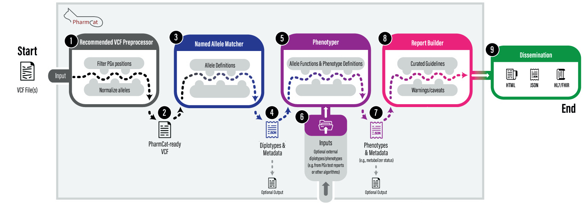

# A Tutorial for Pharmacogenomics Clinical Annotation Tool (PharmCAT)

<div id='pageTop'/> 


By the end of this tutorial, you will know how to use PharmCAT for data analysis and annotation.

This repository provides genetic data and other materials that you need to familiarize yourself with PharmCAT v2.0.

> **Note**: parallel computing feature will be added in the near future to the PharmCAT VCF preprocessor and PharmCAT!

> **Citing PharmCAT**: 
> 1. Klein, T. E. & Ritchie, M. D. PharmCAT: A Pharmacogenomics Clinical Annotation Tool. Clin Pharmacol Ther 104, 19–22 (2018).
> 2. Sangkuhl, K. et al. Pharmacogenomics Clinical Annotation Tool (PharmCAT). Clin Pharmacol Ther 107, 203–210 (2020).

*******
Table of contents
1. [Intro to PharmCAT](#introToPharmcat)
2. [Why use PharmCAT](#whyPhramcat)
3. [Set up the environment for the tutorial](#setupEnv)
4. [Run the PharmCAT VCF preprocessor (strongly recommended)](#vcfPreprocessor)
5. [Run PharmCAT](#runPharmcat)
   1. [The whole PharmCAT](#runPharmcat)
   2. [Individual PharmCAT modules](#individualModule)
   3. [Outside PGx calls](#outsideCall)
   4. [Batch-annotation on multiple individuals](#batchAnalysis)
   5. [Extracting the PharmCAT JSON data into a TSV file](#json2tsv)
6. [Transfer ]
*******

<div id='introToPharmcat'/> 

## 1. Intro to PharmCAT 

Pharmacogenomics Clinical Annotation Tool (PharmCAT) is a software tool that serves the global pharmacogenomics (PGx) and clinical communities and promotes clinical implementation of PGx. PharmCAT digests an individual's genetic data in a VCF file (a common genetic data file format), infers PGx information (PGx alleles, diplotypes, and phenotypes), and generates a drug prescribing recommendation report for the individual. 


You can find more information about the PharmCAT project and tool on [pharmcat.org](https://pharmcat.org/).

This figure explains the workflow of PharmCAT. We will explore every part of PharmCAT that is represented in this figure. You will have a better understanding about each part at the end of this tutorial.



[Back to Top](#pageTop)
<div id='whyPhramcat'/> 


## 2. Why use PharmCAT

PGx is the low-hanging fruit of precision medicine and a research field that we are likely to witness near-term success of individualized clinical care. 

PharmCAT has the following features that make it a desired tool for PGx implementation in clinical care. 

(1) **Scalability** as an automated end-to-end annotation tool.

(2) **Standardization** in end-to-end PGx annotation from genotypes to drug prescribing recommendations. 

(3) **Flexibility** as PharmCAT takes various types of PGx calls from other PGx annotation tools to provide guideline-based recommendations.

(4) **Modularization** of functional parts that meet different clinical and research purposes.

[Back to Top](#pageTop)
<div id='setupEnv'/> 


## 3. Setup for the tutorial

Three [GeT-RM](https://www.cdc.gov/labquality/get-rm/AboutGet-RM.html) samples will be used for this tutorial. We prepared VCF files from the [30x whole-genome sequencing data](https://doi.org/10.1101/2021.02.06.430068). The files are available under the _data/_ folder. 


### 3.1. (Recommended) Pre-prepared Docker container

This tutorial is going to use a pre-prepared Docker image that comes with all pre-requisite software and dependencies for you to successfully run PharmCAT without worries or extra efforts. 

To run a Docker image on your computer, you need to [download Docker here](https://docs.docker.com/get-docker/). 

Once you finish the download, open the Docker application. (Don't forget to register a Docker account!)


 -> highlight run

 -> 3 dots to open the running container in a terminal (by default the integrated terminal)


### 3.2. (Alternative) Running in your own computing environment

If you don't want to use the pre-prepared Docker image, you can run PharmCAT using your own computing environment, _e.g._, terminal in macOS. Make sure you have the following software and dependencies in your system:

1. java 17 or higher, _e.g._, [OpenJDK by Adoptium](https://adoptium.net)
2. PharmCAT Jar file from [the PharmCAT webpage](https://pharmcat.org/) or [the PharmCAT GitHub repository releases page](https://github.com/PharmGKB/PharmCAT/releases/latest).
3. PharmCAT's VCF preprocessor
   1. Downloadable from [the PharmCAT GitHub repository releases page](https://github.com/PharmGKB/PharmCAT/releases/latest)
   2. Python >= 3.9.4 (Note that Python 3.11 has not been tested yet)
   3. [bcftools >= 1.16](http://www.htslib.org/download/)
   4. [bgzip from htslib >= 1.16](http://www.htslib.org/download/)
   5. Python3 package: pandas >= 1.5.1
   6. Python3 package: scikit-allell >= 1.3.5
4. JSON to TSV
   1. [R >= 4.0.4](https://www.r-project.org/)
   2. rjson >= 0.2.20
   3. optparse >= 1.6.6
   4. tidyverse >= 1.3.0
   5. foreach >= 1.5.2
   6. doParallel >= 1.0.17

Please clone this PharmCAT tutorial GitHub repo for the prepared VCF data. You can use the following commands:
```shell
# download the tutorial material
git clone git@github.com:PharmGKB/PharmCAT-tutorial.git
cd PharmCAT-tutorial/

# please replace “<latest-release>” with the latest release number
# download the latest PharmCAT release
wget https://github.com/PharmGKB/PharmCAT/releases/download/<latest-release>/pharmcat-<latest-release>-all.jar
# download the VCF preprocessor
wget https://github.com/PharmGKB/PharmCAT/releases/download/<latest-release>/pharmcat-preprocessor-<latest-release>.tar.gz 
# unzip
tar -xvf pharmcat-preprocessor-<latest-release>.tar.gz
mv preprocessor/* ./
```

[Back to Top](#pageTop)
<div id='vcfPreprocessor'/> 


## 4. Run the PharmCAT VCF preprocessor

The PharmCAT VCF preprocessor, written in python 3, makes sure the input VCF file(s) meet the [PharmCAT’s VCF requirements](https://pharmcat.org/using/VCF-Requirements/). Different genetic testing labs or sequencing companies prepare their own VCF files using different bioinformatics pipelines. This can lead to slight but consequential differences between VCF files from different sources. We highly recommend preparing and normalizing your VCF files using the PharmCAT VCF preprocessor for the following benefits:
1. Normalizing and standardizing of VCF files ([reference](https://doi.org/10.1093/bioinformatics/btv112))
2. Retaining only PGx allele definiting positions of interest
3. Splitting a multi-sample VCF file into single-sample VCF files for PharmCAT
4. Many other more functions to improve the computing performance and the accuracy of your PGx reports!

:exclamation: Below, we will (1) introduce the basics of the preprocessor and (2) provide some real-world examples.

### 4.1. How to use the PharmCAT VCF preprocessor

#### 4.1.1. Input and outputs (part 1 or 2)

- The **only** mandatory input is a VCF file
- Outputs include two parts: (1) single-sample VCF file(s) that are ready for PharmCAT, (2) a report of missing PGx positions in your input VCF

#### 4.1.2. PharmCAT syntax (part 2 or 2)

The basic syntax of the PharmCAT VCF preprocessor is as following:
```shell
python3 pharmcat_vcf_preprocess.py -vcf <path_to_vcf(.gz)>
```
A few arguments that are going to be used in this tutorial include:
- `-vcf <path_to_vcf>` = a single-sample VCF file, a multi-sample VCF file, or a list file of VCF file paths. VCF files can be either bgzip-compressed or uncompressed.
- `-refFna <path_to_file>` = path to indexed human reference genome sequence on GRCh38/hg38. The reference genome sequence file can be either compressed or non-compressed, but it must be indexed. The reference genome sequence file will be automatically downloaded (~1 GB) and indexed to the current working directory if not provided by user.
- `-refVcf <path_to_file>` = by default, the `pharmcat_positions.vcf.bgz` under the current working directory and used as the list of reference PGx positions to be extracted from the input.
- `-o <path_to_dir>` = directory path to write the result files to. By default, outputs will be saved to the same directory as the `-vcf` input file

### 4.2. Hands-on Examples

#### 4.2.1. A single-sample VCF file

Let's start with the simplest case where you have only a VCF file for a single sample. We will use _NA18526_ for example here.

Run the following command to preprocess the VCF file for _NA18526_. 
```shell
# copy and paste the command to the docker image
mkdir -p results/pharmcat_ready/
python3 pharmcat_vcf_preprocess.py \
  -vcf data/pharmcat_tutorial_get-rm_wgs_30x_grch38.NA18526.vcf.bgz \
  -refFna reference.fna.bgz \
  -refVcf pharmcat_positions.vcf.bgz \
  -o results/pharmcat_ready/
  
# outputs
# 1. results/pharmcat_ready/NA18526.preprocessed.vcf
# 2. results/pharmcat_ready/pharmcat_tutorial_get-rm_wgs_30x_grch38.NA18526.missing_pgx_var.vcf.bgz
```
<details>
   <summary>Click to see what it looks like in a Docker container</summary>
   
</details>


#### 4.2.2. A multi-sample VCF file

VCF files are usually comprised of multiple samples. As PharmCAT currently takes only a single-sample VCF, the VCF preprocessor can help prepare and split the multi-sample VCF file by samples for PharmCAT.

Here we have an exemplary multi-sample VCF file that has genotype data for three (3) samples, _NA18526_, _NA18565_, and _NA18861_.
```shell
# copy and paste the command to the docker image
mkdir -p results/pharmcat_ready/
python3 pharmcat_vcf_preprocess.py \
  -vcf data/pharmCAT_tutorial_get-rm_wgs_30x_grch38.vcf.bgz \
  -refFna reference.fna.bgz \
  -refVcf pharmcat_positions.vcf.bgz \
  -o results/pharmcat_ready/

# outputs
# 1. results/pharmcat_ready/NA18526.preprocessed.vcf
# 2. results/pharmcat_ready/NA18565.preprocessed.vcf
# 3. results/pharmcat_ready/NA18861.preprocessed.vcf
# 4. results/pharmcat_ready/pharmcat_tutorial_get-rm_wgs_30x_grch38.missing_pgx_var.vcf.bgz
```
<details>
   <summary>Click to see what it looks like in a Docker container</summary>
   
</details>

#### 4.2.3. Multiple VCFs of non-overlapping genetic blocks

Large-scale genetic data is commonly divided into multiple by-chromosome VCF files or VCF files of consecutive genetic blocks. These VCF files should have the same set of samples and non-overlapping genetic regions. The input VCF list file must be sorted by chromosome positions.

```shell
# copy and paste the command to the docker image
mkdir -p results/pharmcat_ready/
python3 pharmcat_vcf_preprocess.py \
  -vcf data/input_vcf_list.txt \
  -refFna reference.fna.bgz \
  -refVcf pharmcat_positions.vcf.bgz \
  -o results/pharmcat_ready/

# outputs
# 1. results/pharmcat_ready/NA18526.preprocessed.vcf
# 2. results/pharmcat_ready/NA18565.preprocessed.vcf
# 3. results/pharmcat_ready/NA18861.preprocessed.vcf
# 4. results/pharmcat_ready/input_vcf_list.missing_pgx_var.vcf.bgz
```
<details>
   <summary>Click to see what it looks like in a Docker container</summary>
   
</details>


[Back to Top](#pageTop)
<div id='runPharmcat'/> 


## 5. Run PharmCAT

Now we are getting to the exciting part - running PharmCAT!

### 5.1. The whole PharmCAT

The minimal command you can use to run PharmCAT is as simple as the following:
```shell
java -jar <path_to_the_latest_pharmcat_jar> -vcf <sample_file>
```
- `-jar <path_to_jar_file>` = the compiled PharmCAT Jar file.
- `-vcf <sample_file>` = a non-compressed, single-sample VCF file, which must comply with PharmCAT’s VCF requirements. If multiple samples are present, only the first one will be analyzed.

A few optional arguments and flags:
- `-o <output_dir>` = directory path to write the result files to. By default, outputs will be saved - to the same directory as the input VCF file.
- `-bf <output_name>` = the prefix for output files (e.g., <output_name>.html).
- `-del` = a flag to remove the intermediate outputs and save only the HTML report.

:exclamation: Note that all these optional arguments and flags are effective in individual PharmCAT modules that we are going to introduce later. The up-to-date list of the PharmCAT arguments and flags can always be found on the [PharmCAT website](https://pharmcat.org/using/Running-PharmCAT/). If you are not sure what arguments are available for a specific PharmCAT module, use `java -jar pharmcat-<latest_release>-all.jar -h \`

Take _NA18526_ for example again, here to run PharmCAT:
```shell
mkdir -p results/pharmcat_all/
java -jar pharmcat-<latest_release>-all.jar -vcf results/pharmcat_ready/NA18526.preprocessed.vcf -o results/pharmcat_all/
```

You should see the following outputs:
```shell
ls results/pharmcat_all/
NA18526.preprocessed.match.json
NA18526.preprocessed.phenotype.json
NA18526.preprocessed.report.html
```

[Back to Top](#pageTop)
<div id='individualModule'/> 

### 5.2. Run individual PharmCAT modules

If you want specific results from PharmCAT, say the PGx allele matching results from the PharmCAT Named Allele Matcher or the inferred phenotypes from the PharmCAT Phenotyper, you can run the individual PharmCAT modules.

Using individual modules of PharmCAT is easy. You only need to specify the module that you want to run using the flags - `-matcher`, `-phenotyper`, `-reporter`, or a combination of them.

#### 5.2.1. Run only the PharmCAT Named Allele Matcher

The PharmCAT Named Allele Matcher takes the input VCF file, matches the genetic data to the PGx allele definitions in PharmCAT, and infers the sample’s genotypes/diplotypes if available.

Try the following command in the Docker:
```shell
mkdir -p results/pharmcat_matcher/
java -jar pharmcat-<latest_release>-all.jar \
  -matcher -matcherHtml \
  -vcf results/pharmcat_ready/NA18526.preprocessed.vcf \
  -o results/pharmcat_matcher/
```
(For illustration purposes, here we also provides `-matcherHtml`, which saves the results also in a reader-friendly HTML file.)

#### 5.2.2. Run only the PharmCAT Phenotyper

The PharmCAT Phenotyper provides allele function and predicted phenotype information of a sample by ingesting the genotypes/diplotypes identified by the PharmCAT Name Allele Matcher.

Try the following command in the Docker:
```shell
# Use the Named Allele Matcher JSON
mkdir results/pharmcat_phenotyper/
java -jar pharmcat-<latest_release>-all.jar \
  -phenotyper \
  -pi results/pharmcat_matcher/NA18526.preprocessed.json \
  -o results/pharmcat_phenotyper/
```
- `-pi <json_file>` = the Phenotyper input. The JSON file generated by the Named Allele Matcher

Now, what if you want to start from the VCF file? You can totally do so. Try out the following:
```shell
# Use a VCF file and run both the Named Allele Matcher and the Phenotyper
java -jar pharmcat-<latest_release>-all.jar \
  -matcher  -phenotyper \
  -vcf results/pharmcat_ready/NA18526.preprocessed.vcf \
  -o results/pharmcat_phenotyper/
```
**Note** `-pi <json_file>` cannot be used with `-vcf`.

#### 5.2.3. Run only the PharmCAT Phenotyper

The PharmCAT Reporter takes the genotype/diplotype and phenotype data from the Phenotyper, interprets the data of relevant drug annotation, includes appropriate warnings and caveats, and generates a comprehensive, reader-friendly report.

Try the following command in the Docker:
```shell
mkdir results/pharmcat_reporter/
java -jar pharmcat-<latest_release>-all.jar \
  -reporter \
  -ri results/pharmcat_phenotyper/NA18526.preprocessed.phenotype.json \
  -o results/pharmcat_reporter/
```
- `-ri <phenotyper_json_file>` = the Reporter input. The JSON file generated by the Phenotyper.


[Back to Top](#pageTop)
<div id='outsideCalls'/> 


### 5.3. Incorporate outside PGx calls

PharmCAT allows users to supply genotypes or phenotypes that are derived from other means, referred to as “outside” data as they are not generated by PharmCAT. 

PharmCAT expects the outside calls in a tab-delimited file. Each file contains the outside calls for one sample. Each line in the file is the genotype or phenotype information for a certain gene with up to four fields, including (1) HGNC gene symbol, (2) diplotype or a single-allele call, (3) a phenotype, or (4) an activity score for a gene. 

For example:
```shell
$ cat data/example_outside_calls.txt
CYP2D6	*1/*3
CYP2C9			2.0
G6PD	B (wildtype)/B (wildtype)
HLA-B		*57:01 positive
MT-RNR1	1555A>G
```

Now, try it yourself. Generate a PharmCAT report with the outside PGx genotype or phenotype data.
```shell
java -jar pharmcat-<latest_release>-all.jar \
  -vcf results/pharmcat_ready/NA18526.preprocessed.vcf \
  -po data/outside_calls_from_get-rm.NA18526.txt \
  -o results/pharmcat_all/
```
- `-po <path_to_outside_call>` = a tab-delimited file of outside PGx genotype or phenotype data for the sample

[Back to Top](#pageTop)
<div id='batchAnalysis'/> 


### 5.4. Batch-annotation on multiple individuals

> **Note** parallele feature for the PharmCAT VCF Preprocessor and PharmCAT itself will be updated in the near future.

The fast manner of PharmCAT in generating a report (~2 seconds per sample) enables it to process a biobank-scale data. 

Depending on the computing environment, you can adapt the following script to parallelize your PharmCAT jobs. 
```shell
for SINGLE_SAMPLE in $(cat data/test_get-rm_samples.txt)
do
  java -jar pharmcat-<latest_release>-all.jar \
    -vcf results/pharmcat_ready/"$SINGLE_SAMPLE".preprocessed.vcf \
    -o results/pharmcat_all/
done
```

Incorporating outside genotype or phenotype data files is straightforward. See the following exemplary codes:  
```shell
for SINGLE_SAMPLE in $(cat data/test_get-rm_samples.txt)
do
  java -jar pharmcat-<latest_release>-all.jar \
    -vcf results/pharmcat_ready/"$SINGLE_SAMPLE".preprocessed.vcf \
    -po data/outside_calls_from_get-rm."$SINGLE_SAMPLE".txt \
    -o results/pharmcat_all/ 
done
```

[Back to Top](#pageTop)
<div id='json2tsv'/> 


### 5.5. Extracting the PharmCAT JSON data into a TSV file

We also provide accessory R scripts that organize and extract content from the Named Allele Matcher or Reporter JSON outputs into tab-separated values (TSV) files, which is a format commonly used in data analysis. 

```shell
# Extract the allele matching details from the PharmCAT Named Allele Matcher JSON files
Rscript src/json2tsv_pharmcat_named_allele_matcher.R \
  --input-dir results/pharmcat_matcher/ \
  --input-file-pattern *match.json \
  --output-dir ./

# Extract the phenotype details that are used for drug prescribing recommendations from the PharmCAT Reporter JSON files
Rscript src/json2tsv_pharmcat_report.R \
  --input-dir results/pharmcat_all/ \
  --input-file-pattern *report.json \
  --output-dir ./
```

[Back to Top](#pageTop)


Reference:
[^1] Byrska-Bishop, M. et al. High coverage whole genome sequencing of the expanded 1000 Genomes Project cohort including 602 trios. 2021.02.06.430068 Preprint at https://doi.org/10.1101/2021.02.06.430068 (2021).

## Acknowledgement
PharmCAT is managed at Stanford University & University of Pennsylvania (NHGRI U24HG010862).

